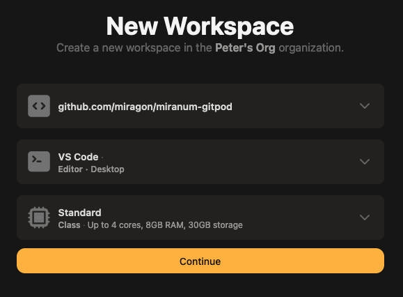
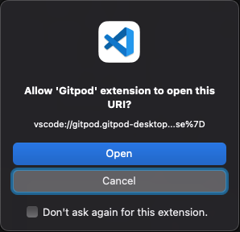
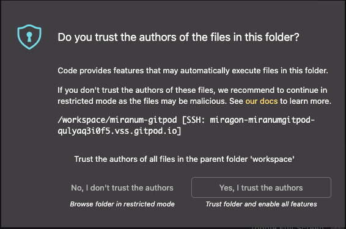

<!-- PROJECT SHIELDS -->
[![Contributors][contributors-shield]][contributors-url]
[![Forks][forks-shield]][forks-url]
[![Stargazers][stars-shield]][stars-url]
[![Issues][issues-shield]][issues-url]
[![MIT License][license-shield]][license-url]
<!-- END OF PROJECT SHIELDS -->

<!-- PROJECT LOGO -->
 

    
    
    <h3 ><a href="https://miranum.com/">Miranum IDE</a> <i>by <a href="https://miragon.io/">Miragon</a></i></h3>
    

        <i>One IDE for everything!</i>
    

## About The Project

This repository showcases the use of [GitPod](https://www.gitpod.io/) together with [Miranum IDE](https://miranum.io/).

## Pre-requisites

1. Install [VS Code](https://code.visualstudio.com/download) on your maschine

2. Install VS Code Plugins
   * [Gitpod](https://marketplace.visualstudio.com/items?itemName=gitpod.gitpod-desktop)
   * [Gitpod Remote](https://marketplace.visualstudio.com/items?itemName=gitpod.gitpod-remote-ssh)
   * [Remote - SSH](https://marketplace.visualstudio.com/items?itemName=ms-vscode-remote.remote-ssh)
   * [Miranum IDE](https://marketplace.visualstudio.com/items?itemName=miragon-gmbh.miranum-ide)

## Getting started

1. (Optional) Install the [Browser Extension](https://www.gitpod.io/docs/configure/user-settings/browser-extension)
    * [Chrome](https://chrome.google.com/webstore/detail/gitpod-online-ide/dodmmooeoklaejobgleioelladacbeki)
    * [Firefox](https://addons.mozilla.org/en-US/firefox/addon/gitpod/)

2. Login to [GitPod](https://gitpod.io/)

3. Open a **Workspace**
    * by prefixing the URL with `gitpod.io/#` (e.g. `gitpod.io/#https://github.com/miragon/miranum-gitpod`)
    * by clicking the GitPod button in the repository's README.md (only available with the browser extension installed)
    * by clicking [New Workspace](https://gitpod.io/workspaces)

4. Configure Workspace Options

   

5. Navigate through the different popups in VS Code

   |                                 Allow `Gitpod` to open URL                                  |                            Trust Author                             |
   |:-------------------------------------------------------------------------------------------:|:-------------------------------------------------------------------:|
   |  |  |

6. Initialize `.gitpod.yml`
   * Open the Terminal in VS Code (View > Terminal)
   * Run `gp init`

## Usage

### Push to GitHub via Gitpod

1. Update your *User Settings*
   1. Go to your [User Settings](https://gitpod.io/access-control)
   2. Click the three dots on the right side of the line that says `GitHub`
   3. Click `Edit Permissions`
   4. Grant the permissions to your need (e.g. `public_repo` to allow *write access* to your public repositories)

## License

Distributed under the [Apache License Version 2.0](LICENSE).

(<a href="#top">back to top</a>)

<!-- MARKDOWN LINKS & IMAGES -->
<!-- https://www.markdownguide.org/basic-syntax/#reference-style-links -->

[contributors-shield]: https://img.shields.io/github/contributors/Miragon/miranum-gitpod.svg?style=for-the-badge

[contributors-url]: https://github.com/Miragon/miranum-gitpod/graphs/contributors

[forks-shield]: https://img.shields.io/github/forks/Miragon/miranum-gitpod.svg?style=for-the-badge

[forks-url]: https://github.com/Miragon/miranum-gitpod/network/members

[stars-shield]: https://img.shields.io/github/stars/Miragon/miranum-gitpod.svg?style=for-the-badge

[stars-url]: https://github.com/Miragon/miranum-gitpod/stargazers

[issues-shield]: https://img.shields.io/github/issues/Miragon/miranum-gitpod.svg?style=for-the-badge

[issues-url]: https://github.com/Miragon/miranum-gitpod/issues

[license-shield]: https://img.shields.io/github/license/Miragon/miranum-gitpod.svg?style=for-the-badge

[license-url]: https://github.com/Miragon/miranum-gitpod/blob/main/LICENSE
